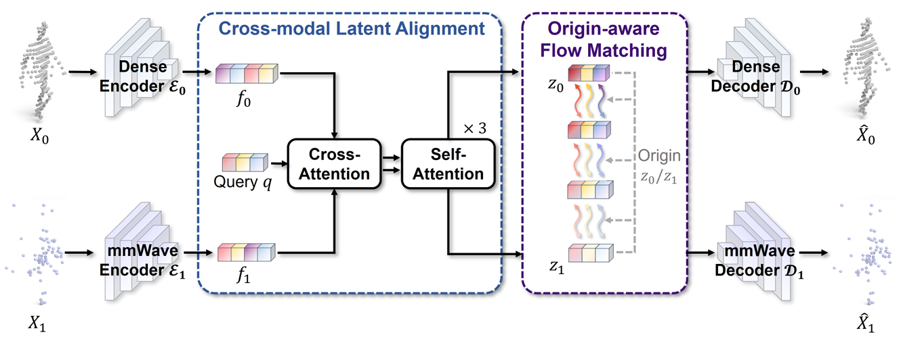

<p align="center">
  <h1 align="center">mmWaveFlow: Unified Enhancement and Generation of mmWave Human Point Clouds
  <h3 align="center"><a href="https://openaccess.thecvf.com/content/CVPR2026/papers/Su_mmWaveFlow_Unified_Enhancement_and_Generation_of_mmWave_Human_Point_Clouds_CVPR_2026_paper.pdf">Paper</a>     <a href="https://www.youtube.com/watch?v=86tBcnnKxGk">Video</a> </h3></p><h3 align="center">


<p align="center">
  
</p>


## 🔥 Highlights

* **Unified framework**. mmWaveFlow is based on a flow matching model and unifies the enhancement and generation of mmWave human point clouds. 💪
* **More friendly**. mmWaveFlow can train all models on less 24G GPU memory (i.e., RTX 3090 are enough to train mmWaveFlow). 😀

## News
* **2026.02**: mmWaveFlow has been accepted by CVPR 2026. 🎉


## Requirements

Please refer to the requirements.txt file and install the [PyTorchEMD](https://github.com/daerduoCarey/PyTorchEMD) .

## Data **Processing**

Prepare parametric human models and related files.

* **SMPL**. Download the SMPL models from [here](https://smpl.is.tue.mpg.de/) and place them under `model/smpl/pytorch/models/`.

Prepare the data.

* **mmBody**
  * Download the dataset from [here](https://github.com/Chen3110/mmBody) and place them under `data/mmbody/`.
* **MRI**
  * Download the dataset from [here](https://github.com/SizheAn/mRI) and place them under `data/mri/`.
* **MM-Fi**
  * Download the dataset from [here](https://github.com/ybhbingo/MMFi_dataset) and place them under `data/mmfi/`.

I refactored the code but haven't tested the data-preprocessing part yet — there might be small issues like wrong paths. I'll revisit and improve the code when I have time.


## Train and Test
* Train and test mmWaveFlow on mmBody
```shell script
python train.py dataset=mmbody
```

* Train and test mmWaveFlow on MRI
```shell script
python train.py dataset=mri
```

* Train and test mmWaveFlow on MM-Fi
```shell script
python train.py dataset=mmfi
```


## Downstream Task

No plans to open-source this code for now — sorting out the whole workflow is a bit of a hassle.

If you'd like to reproduce the results, the following two details might be helpful.

- The released code normalizes the input point cloud to the origin. When training the mmWaveflow for point cloud enhancement in human mesh recovery, we skip this normalization to retain the original position, as this is more reasonable for the task.
- For generating mmWave point clouds, we will downsample the output using Open3D's `voxel_down_sample` with a voxel size of 0.001.

## Citation

If you find this method and/or code useful, please consider citing

```
@InProceedings{Su_2026_CVPR,
    author    = {Su, Chang and Jin, Beihong and Shi, Qiwen and Wang, Zhi},
    title     = {mmWaveFlow: Unified Enhancement and Generation of mmWave Human Point Clouds},
    booktitle = {Proceedings of the IEEE/CVF Conference on Computer Vision and Pattern Recognition (CVPR)},
    month     = {June},
    year      = {2026},
    pages     = {31366-31376}
}
```

## Acknowledgements
We thank these great works and open-source repositories (in no particular order).

- [3DShape2VecSet](https://github.com/1zb/3DShape2VecSet)
- [RectifiedFlow](https://github.com/gnobitab/RectifiedFlow) 
- [DiT](https://github.com/facebookresearch/DiT) 
